# SCOOT - Cornwall's Local Ridesharing App

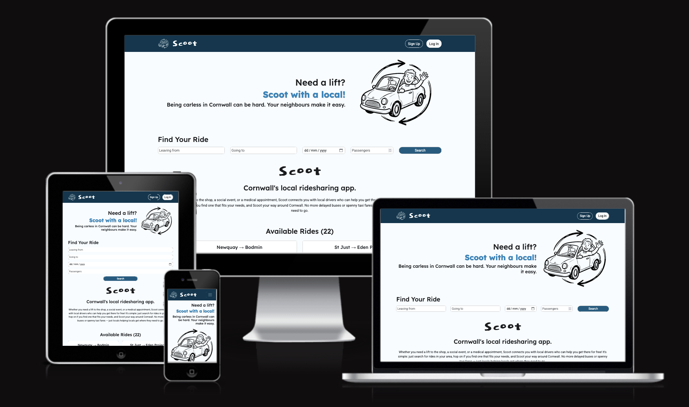
_Scoot website displayed across multiple devices — desktop, tablet, and mobile_

### Live Site: https://scoot-a40a37bf8bcb.herokuapp.com/

# Ideation

### Problem Statement

It's difficult getting anywhere in Cornwall without a car. Public transport is limited and taxis can be pricey. Many Cornish residents lack accessible transport to get to the shop, social or medical appointment.

### Purpose

Scoot is a ride sharing platform designed to connect local drivers with neighbours who need a lift. The project aims to streamline ride management, request handling, and user authentication in a user-friendly web application.

# User Experience Design

**External User’s Goal:** Access simple, reliable, and friendly ride-sharing options in Cornwall, with clear information on available rides, easy booking, and a welcoming, community-focused interface.

**Site Owner’s Goal:** Build a trustworthy platform that connects local drivers and passengers, making shared transport accessible and safe. The emphasis is on intuitive navigation, responsive design, and a supportive user experience using Django and Bootstrap.

### User Stories

| User                                | User Story                                                                                                                                                             | Priority    | Completed |
| ----------------------------------- | ---------------------------------------------------------------------------------------------------------------------------------------------------------------------- | ----------- | --------- |
| Restricted page access              | As a site user, I cannot access restricted pages when logged out so that the application is secure.                                                                    | Must Have   | ✅        |
| Account registration                | As a site user, I can register for an account so that I can access ride features.                                                                                      | Must Have   | ✅        |
| Account login and logout            | As a registered user, I can log in and log out so that I can securely access my account.                                                                               | Must Have   | ✅        |
| Account login status                | As a site user, I can see my login status in the navbar so that I know whether I'm logged in.                                                                          | Must Have   | ✅        |
| Create ride (CRUD)                  | As a logged-in user, I can create a ride listing so that I can offer a lift to others.                                                                                 | Must Have   | ✅        |
| View ride list (CRUD)               | As a site user, I can search, filter and view a list of available rides so that I can find a suitable lift.                                                            | Must Have   | ✅        |
| View ride detail (CRUD)             | As a site user, I can view the full details of a ride so that I can decide if it suits me.                                                                             | Must Have   | ✅        |
| Edit ride (CRUD)                    | As a ride creator, I can edit my ride listing so that I can update details if plans change.                                                                            | Must Have   | ✅        |
| Delete ride (CRUD)                  | As a ride creator, I can delete my ride listing from the front end so that I can remove rides I no longer offer.                                                       | Must Have   | ✅        |
| Request ride (CRUD)                 | As a passenger, I can request to join a ride so that I can get a lift.                                                                                                 | Should Have | ✅        |
| View ride request (CRUD)            | As a passenger, I can see the status of my ride requests so that I know whether I've been accepted.                                                                    | Should Have | ✅        |
| Edit & delete ride request (CRUD)   | As a passenger, I can edit or cancel my ride request so that I can free up the seat if my plans change.                                                                | Could Have  | ✅        |
| View pending ride requests (CRUD)   | As a driver, I can see pending requests on my rides so that I can manage my passengers.                                                                                | Should Have | ✅        |
| Approve/decline ride request (CRUD) | As a driver, I can approve or decline a ride request so that I can choose my passengers.                                                                               | Should Have | ✅        |
| CRUD confirmation Messages          | As a user, I can see confirmation messages after creating, editing, or deleting a ride so that I know my action was successful.                                        | Must Have   | ✅        |
| Admin management                    | As an admin, I can manage all users and ride listings via the admin panel so that I can moderate content.                                                              | Must Have   | ✅        |
| Welcoming homepage                  | As a site user, I can see a welcoming homepage that explains the service so that I understand what Scoot is and how to use it.                                         | Must Have   | ✅        |
| Responsivity                        | As a site user, I can view the site on any device so that I can use it on my phone or computer.                                                                        | Must Have   | ✅        |
| Site navigation                     | As a site user, I can easily navigate the site so that I can find what I need quickly.                                                                                 | Must Have   | ✅        |
| User profile                        | As a registered user, I can create a profile with my name, location, and a short bio so that other users can learn a bit about me before sharing a ride.               | Should Have | ❌        |
| Driver ratings                      | As a passenger, I can leave a rating for a driver after a completed trip so that other users can make informed decisions.                                              | Could Have  | ❌        |
| Autocomplete location suggestions   | As a driver creating a ride, I want location autocomplete suggestions when typing origin and destination so that I can quickly select valid locations and avoid typos. | Could Have  | ❌        |
| AI Transport Suggestions            | As a passenger, I can see alternative transport options when no rides match so that I still have a way to get where I need to go.                                      | Could Have  | ❌        |
| AI Natural Language Ride Finder     | As a passenger, I can describe my journey in plain English so that the app finds matching rides without me filling in multiple form fields.                            | Could Have  | ❌        |

### Wireframes

The following wireframes were used to design the skeleton:
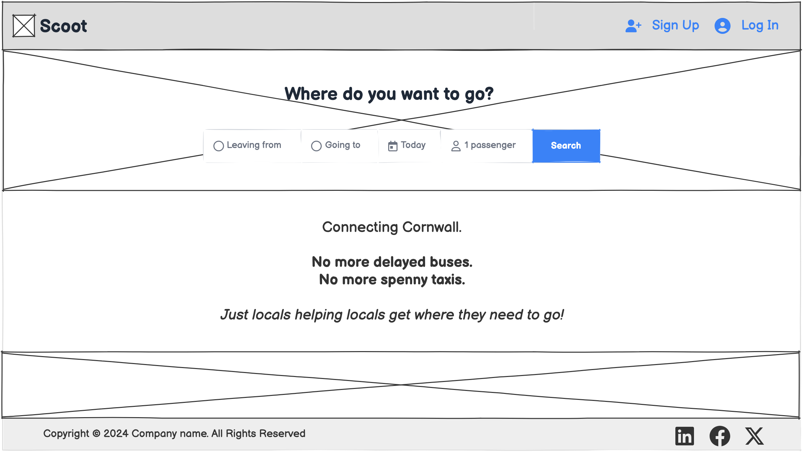_Wireframe of homepage on desktop_<br>
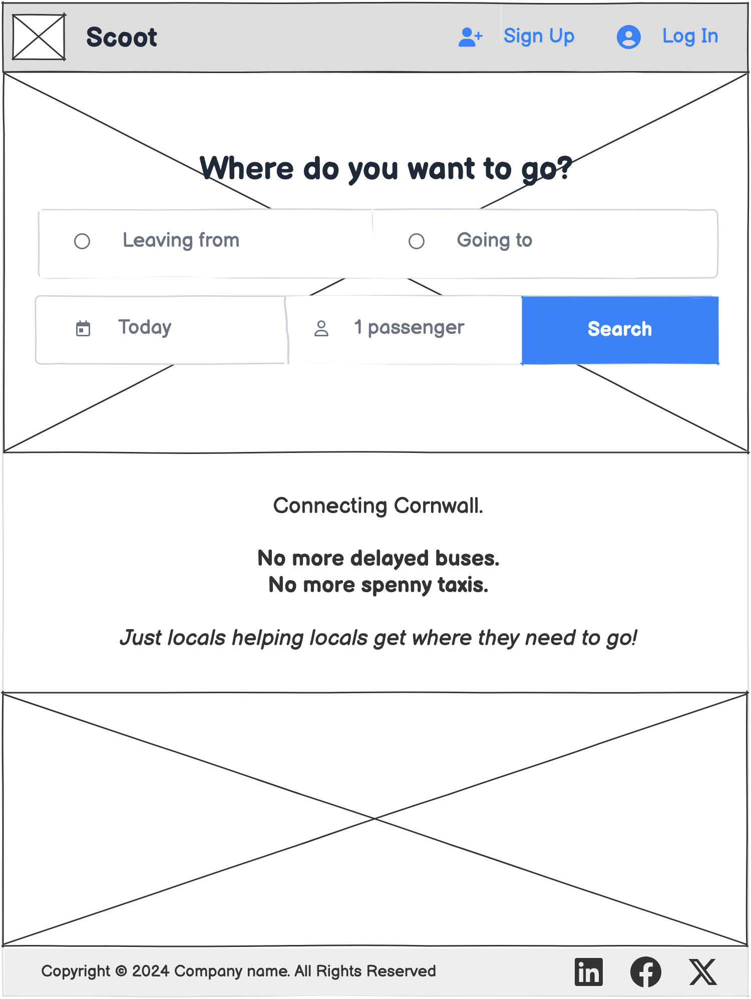
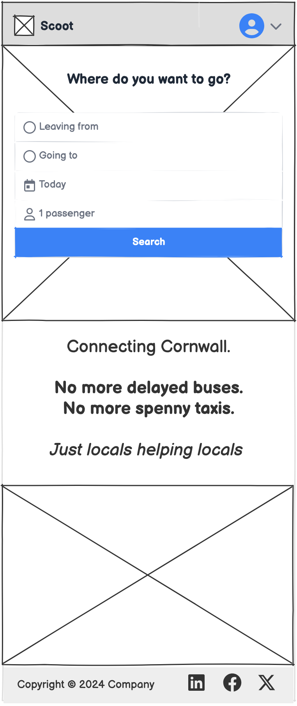_Wireframe of homepage on tablet and mobile_

### Surface Design

Scoot’s surface, front-end design emphasizes clarity, friendliness, and accessibility. Rounded buttons and cards create a welcoming, modern feel. Bootstrap is used for responsive layouts, ensuring the site looks great on any device. Icons and feedback messages guide users intuitively through the ride-sharing process, supporting both new and returning visitors.

### Colours

The color palette uses calming blues to evoke trust and community, while high-contrast elements ensure readability for all users. The palette is implemented using CSS variables for easy theming and consistency across the site.

| Colour Name     | Hex Code | Swatch                                                                                                      | Usage                                 |
| --------------- | -------- | ----------------------------------------------------------------------------------------------------------- | ------------------------------------- |
| Carbon Black    | #1b1c1e  | <span style="display:inline-block;width:24px;height:16px;background:#1b1c1e;border:1px solid #ccc;"></span> | Main text, headings                   |
| Onyx Black      | #111212  | <span style="display:inline-block;width:24px;height:16px;background:#111212;border:1px solid #ccc;"></span> | Secondary text, accents               |
| White           | #ffffff  | <span style="display:inline-block;width:24px;height:16px;background:#ffffff;border:1px solid #ccc;"></span> | Text, icons, backgrounds              |
| Alice Blue      | #f7fcff  | <span style="display:inline-block;width:24px;height:16px;background:#f7fcff;border:1px solid #ccc;"></span> | Main background, cards                |
| Pale Skye       | #beddea  | <span style="display:inline-block;width:24px;height:16px;background:#beddea;border:1px solid #ccc;"></span> | Highlights, hover, subtle backgrounds |
| Deep Space Blue | #02374f  | <span style="display:inline-block;width:24px;height:16px;background:#02374f;border:1px solid #ccc;"></span> | Navbar, footer                        |
| Charcoal Blue   | #0e5c81  | <span style="display:inline-block;width:24px;height:16px;background:#0e5c81;border:1px solid #ccc;"></span> | Primary buttons, footer, links        |
| Blue Bell       | #0d85bd  | <span style="display:inline-block;width:24px;height:16px;background:#0d85bd;border:1px solid #ccc;"></span> | Button hover, accents, slogans        |

### Typography

- **Lexend (sans-serif):** Used for headings, providing a modern, friendly, and highly readable look.
- **Roboto (sans-serif):** Used for body text and most UI elements, chosen for its clarity and accessibility.
- **Dokdo (serif):** Used for logo and special titles, adding a unique, playful character to the brand.

These choices ensure the interface is visually appealing, distinctive, and accessible to a wide range of users.

# Database

Scoot uses a relational database to store all user, ride, and request data securely. The database is structured to support user authentication, ride management, ride requests, and admin moderation. Key tables include User, Ride, and RideRequest, with relationships ensuring data integrity and efficient queries. The schema is designed for scalability and can be migrated to PostgreSQL or another RDBMS for production deployment.

### Entity Relationship Diagram (ERD)

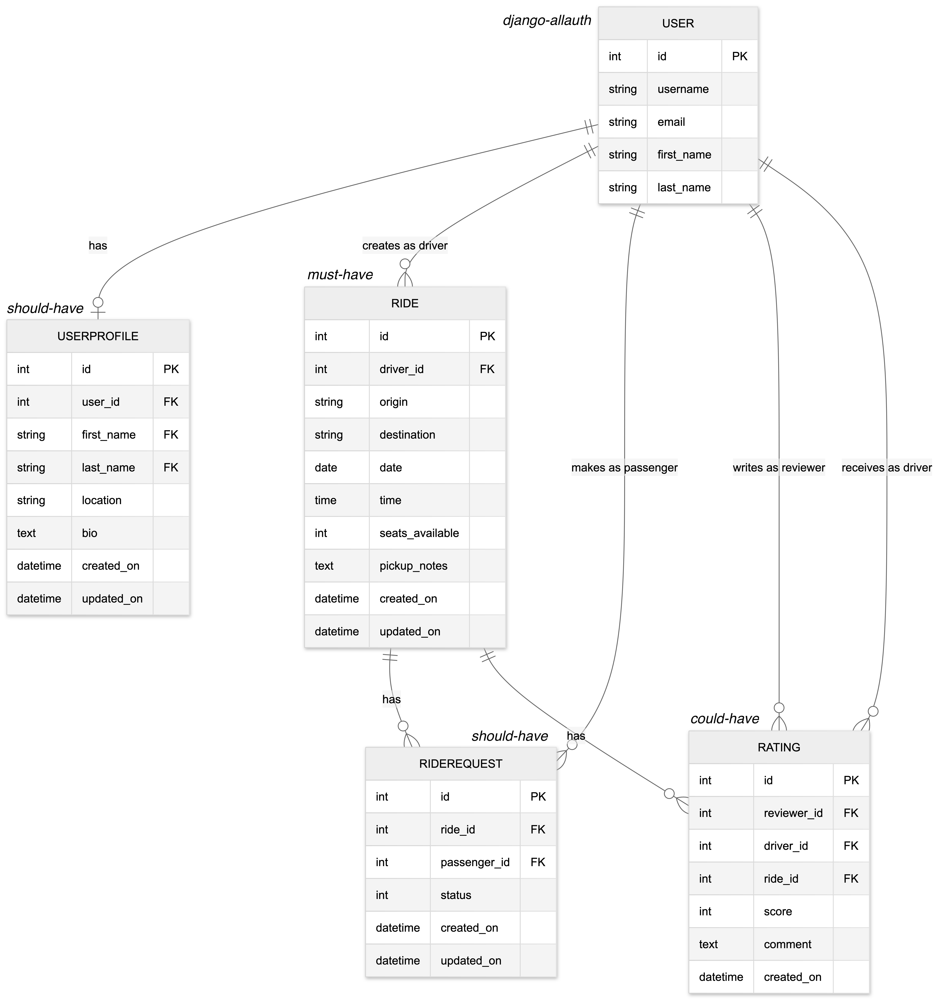

# Features

Scoot offers a comprehensive set of features designed to make ride-sharing in Cornwall easy, intuitive and accessible for everyone to use:

- **User Registration & Authentication:** Secure sign-up, login, and logout with email verification and password management.
- **Ride Search & Filtering:** Easily search and filter available rides to find the best match for your journey.
- **Ride Management (CRUD):** Create, view, edit, and delete ride listings with detailed information including origin, destination, date, time, and available seats.
- **Ride Requests & Booking:** Request to join rides, track request status, and manage bookings directly from your account.
- **Driver Controls:** Approve or decline ride requests, manage passengers, and update ride details.
- **Responsive Design:** Fully optimised for desktop, tablet, and mobile devices using Bootstrap.
- **Accessibility:** Semantic HTML, alt text, and high-contrast colours ensure usability for all users, including those with disabilities.
- **Admin Panel:** Moderation tools for managing users and rides, ensuring platform safety and quality.
- **Confirmation Messages:** Clear feedback for all actions, including ride creation, editing, deletion, and booking.

### Future features

The features below couldn't be implemented due to time constraints but would be able to be added in the future:

- **User Profile:** allowing registered users to create a personalised profile with their name, location, and a short bio. Other users will be able to view a driver's profile directly from ride listings, helping foster trust and community.
- **Driver Ratings:** allowing passengers to leave a rating (1–5 stars with optional comment) for drivers after a completed trip. Sverage rating will be shown next to the driver's name on their ride to help other users make informed decisions.
- **Autocomplete Location Suggestions:** feature for drivers creating a ride, providing real-time autocomplete for origin and destination fields, helping to avoid typos and improve accurace and user experience.
- **AI-Powered Natural Language Ride Finder:** feature to allow passengers to describe their journey in plain English. Powered by an LLM API which will parse the input into structured data and filter the ride list.
- **AI-Powered Alternative Transport Suggestions:** feature to help passengers find local bus routes, taxi firms, and community transport in Cornwall when no rides match. Powered by an LLM API or curated Cornwall transport data.

# Agile Methodology

Scoot was developed using Agile principles, with a strong focus on iterative progress and clear prioritisation. I made extensive use of a GitHub Project board to organise and track all user stories, grouping them into the following epics that reflect the main functional areas of the application:

- **Ride Management (CRUD):** 8/8 closed (100%)
- **Ride Requests & Booking:** 4/4 closed (100%)
- **Front-End Design & UX:** 4/4 closed (100%)
- **Admin Functionality:** 2/2 closed (100%)
- **User Authentication & Profiles:** 4/5 closed (80%)
- **User Notifications & Feedback:** 2/4 closed (50%)
- **AI-Powered Features:** 0/2 closed (0%)

Each epic contained related user stories, and their priority (Must Have, Should Have, Could Have) was clearly labelled using the MoSCoW method.

Throughout development, we:

- Added all user stories as issues to the board, assigned them to the relevant epic, and tackled each epic according to its priority.
- Used board columns (Backlog, To Do, In Progress, In Review, Done) to visualise workflow and track progress.
- Focused first on Must Have stories, ensuring all core features were implemented before moving to Should Have and Could Have items.
- Regularly reviewed and updated the board, closing issues as features were completed and adjusting priorities as needed.

This approach ensured transparency, adaptability, and a clear record of progress for both development and assessment with 20 out of 25 user stories completed.

`[🟩🟩🟩🟩🟩🟩🟩🟩🟩🟩🟩🟩🟩🟩🟩🟩🟩🟩🟩🟩⬜⬜⬜⬜⬜] 80%`

# Testing

Scoot was thoroughly tested to ensure reliability, usability, and assessment readiness.

### Manual testing

Manual test cases were documented for all core features, including user registration, ride management, ride requests, and admin functionality. Each test included steps, expected results, and actual outcomes, with pass/fail status clearly recorded.

| Feature               | Expected Behaviour                                                             | Pass/Fail |
| --------------------- | ------------------------------------------------------------------------------ | --------- |
| User Registration     | User can register with valid details; error shown for invalid input            | ✅        |
| Login/Logout          | User can log in and out; session managed correctly                             | ✅        |
| Ride Creation         | Logged-in user can create a ride listing; form validates and saves to database | ✅        |
| Ride Editing/Deleting | Ride creator can edit or delete their ride; changes reflected in ride list     | ✅        |
| Ride Search/Filter    | Users can search and filter rides; results update accordingly                  | ✅        |
| Ride Requests         | Passenger can request to join a ride; request status tracked                   | ✅        |
| Request Approval      | Driver can approve/decline requests; status updates and confirmation shown     | ✅        |
| Admin Management      | Admin can manage users and rides via admin panel                               | ✅        |
| Responsivity          | Site displays correctly on desktop, tablet, and mobile                         | ✅        |
| Accessibility         | Site passes basic accessibility checks; alt text and colour contrast present   | ✅        |

### Automated testing

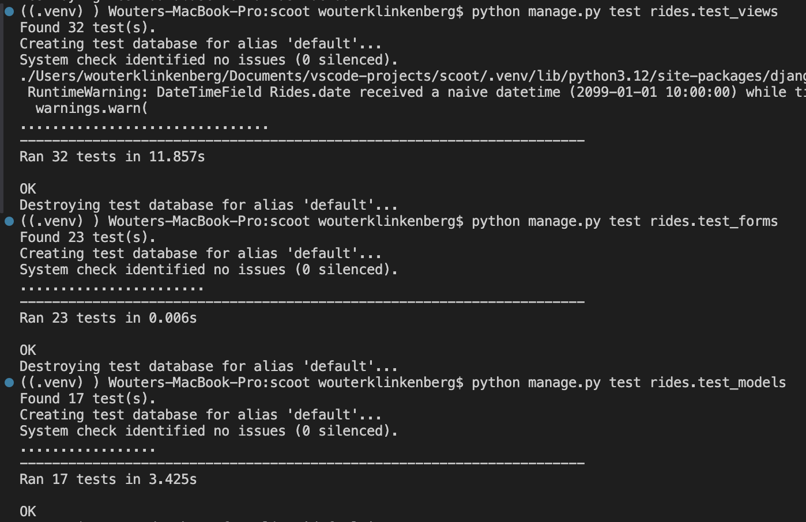

Automated tests were written for key business logic and views using Django’s TestCase framework. The site was also tested for responsiveness, accessibility, and error handling across devices and browsers. All Must Have user stories were verified as working on the deployed site.

### Test results

- **HTML:** 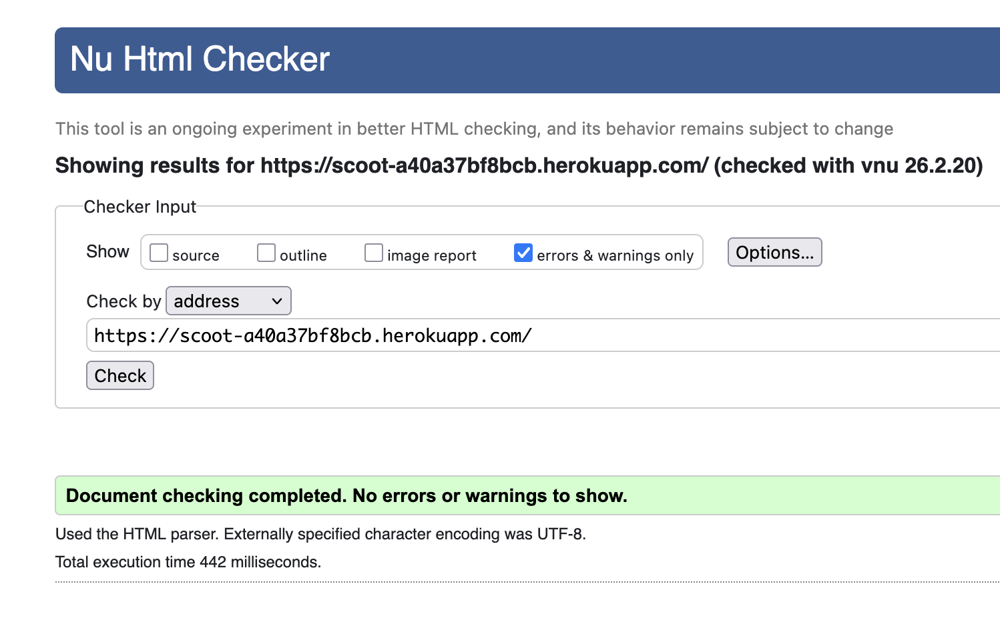
- **CSS:** 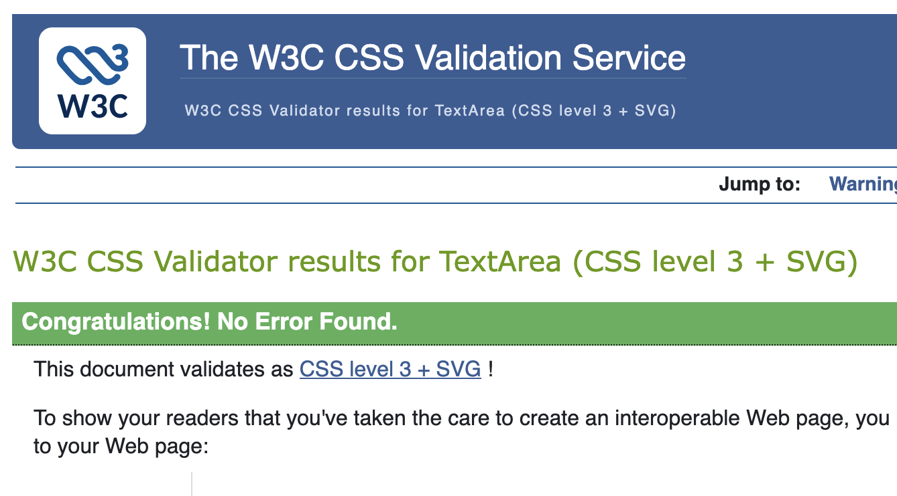
- **JavaScript:** 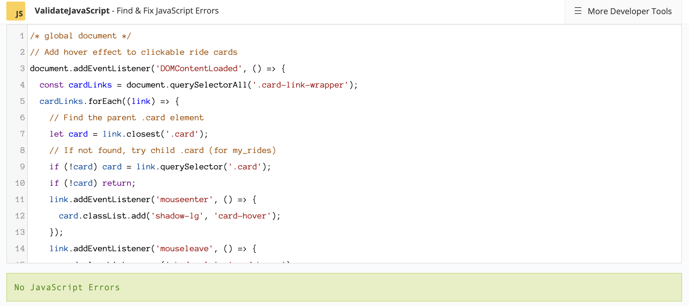
- **Python:** 
- **Wave Accessibility:**<br>
  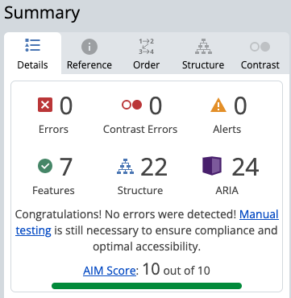
- **Lighthouse Report:**<br>
  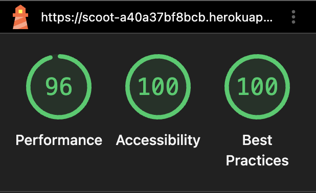

# AI in Development

AI tools, including GitHub Copilot, were strategically used throughout Scoot’s development:

- Assisted in generating Django code aligned with project objectives, streamlining feature creation and reducing manual effort.
- Helped debug code, quickly identifying and resolving bugs to improve reliability.
- Suggested optimisations and refactoring for better performance and user experience.
- Generated automated unit tests for key features, with adjustments made to ensure accuracy and coverage.
- Accelerated workflow, enhanced code quality, and enabled efficient orchestration of the software development process.
- Creation of the Scoot logo

# Deployment

Scoot was deployed to Heroku, ensuring secure and reliable cloud hosting:

- **Version Control:** Git and GitHub were used throughout development, with regular, meaningful commit messages documenting incremental progress and key decisions. The commit history provides a comprehensive record of the project’s evolution.
- **Secure Code Management:** No passwords or sensitive information were committed to the repository. Secret keys and configurations were managed using environment variables and .gitignore, following best practices for security.
- **Cloud Deployment:** The application was successfully deployed to Heroku, matching the development version in functionality. The hosting environment was properly configured to support Django, static files, and environment variables, ensuring robust performance and security.

### How to Deploy Scoot Yourself

To deploy Scoot to Heroku or another cloud platform, follow these steps:

1. **Clone the repository:**
    ```bash
    git clone https://github.com/yourusername/scoot.git
    cd scoot
    ```
2. **Create a virtual environment and install dependencies:**
    ```bash
    python3 -m venv .venv
    source .venv/bin/activate
    pip install -r requirements.txt
    ```
3. **Set environment variables:**
    - Create an `.env` file or set environment variables for `SECRET_KEY`, `DATABASE_URL`, and any other sensitive settings.
    - Ensure `DEBUG=False` for production.
4. **Prepare static files:**
    ```bash
    python manage.py collectstatic
    ```
5. **Apply database migrations:**
    ```bash
    python manage.py migrate
    ```
6. **Deploy to Heroku:**
    - Create a new Heroku app: `heroku create`
    - Set environment variables on Heroku: `heroku config:set SECRET_KEY=your_secret DATABASE_URL=your_db_url DEBUG=False`
    - Push your code: `git push heroku main`
    - Run migrations: `heroku run python manage.py migrate`
    - Collect static files: `heroku run python manage.py collectstatic`

7. **Visit your deployed site:**
    - Heroku will provide a URL for your live app.

For other platforms, follow similar steps, ensuring environment variables and static files are configured. See the official Django and Heroku documentation for more details.

# Credits

Scoot was developed by Wouter Klinkenberg as part of the final capstone project for the Full-Stack Software Development Bootcamp with the Code Institute cohort March 2026.

## Technologies Used

Scoot was built using the following technologies:

- **Django** (Python web framework)
- **Bootstrap** (front-end CSS framework)
- **HTML5**
- **CSS3**
- **JavaScript**
- **PostgreSQL** (database for production)
- **SQLite** (database for development)
- **Heroku** (cloud hosting platform)
- **Git & GitHub** (version control and repository hosting)

## Packages Used

Scoot relies on the following Python packages and libraries:

- django-allauth
- django-crispy-forms
- crispy-bootstrap5
- dj-database-url
- dj3-cloudinary-storage
- cloudinary
- gunicorn
- psycopg2-binary
- whitenoise
- requests
- sqlparse
- packaging
- idna
- six
- charset-normalizer
- urllib3
- asgiref
- certifi

See requirements.txt for full version details.

### Special thanks to:

- GitHub Copilot and AI tools for code generation, debugging, and design inspiration
- Django and Bootstrap communities for documentation and open-source resources
- Heroku for cloud hosting
- Course instructors and peers for feedback and support
- FontAwesome for icons and images used in the project
